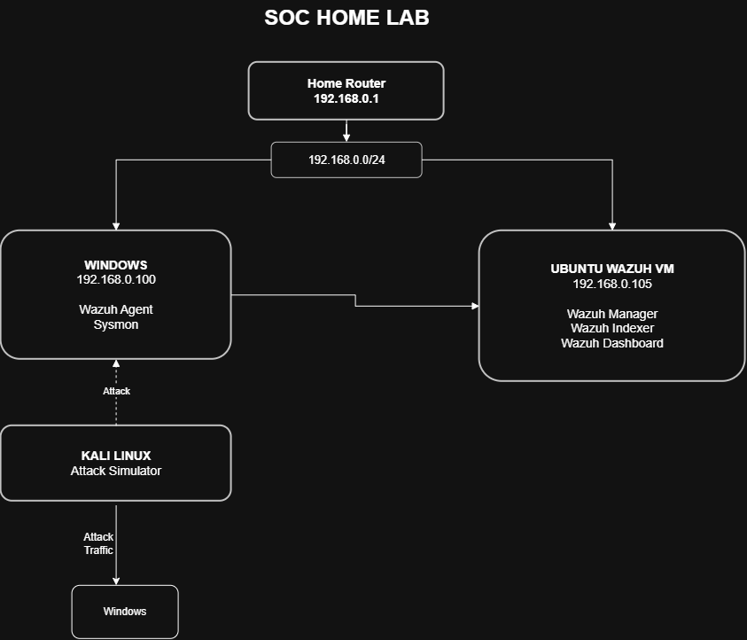
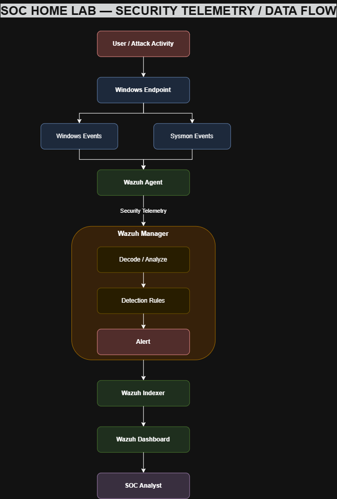
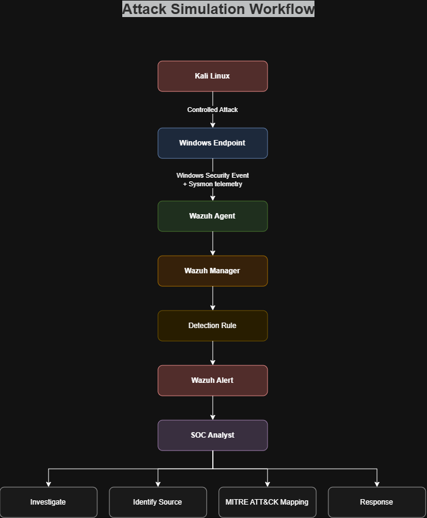
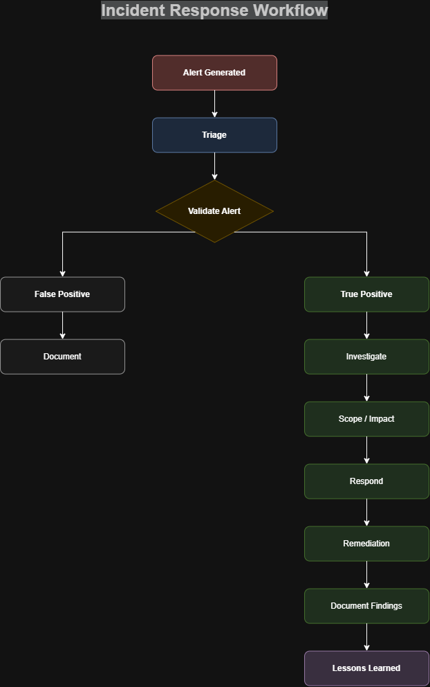

# SOC Home Lab Architecture

This directory documents the architecture, telemetry flow, attack-to-detection workflow, and incident response process used in the SOC home lab.

## 1. SOC Lab Architecture

The lab consists of a Windows endpoint, Ubuntu-based Wazuh server, and Kali Linux attack simulation environment operating within the home network.

## 2. Security Telemetry Data Flow

Security activity generated on the Windows endpoint is collected through Windows event sources and Sysmon, forwarded by the Wazuh Agent, analyzed by the Wazuh Manager, indexed by the Wazuh Indexer, and presented through the Wazuh Dashboard.

## 3. Attack → Detection → Investigation

This diagram documents the workflow used to generate controlled security activity, detect it through Wazuh, and investigate the resulting alert.

## 4. Incident Response Workflow

This diagram documents the SOC investigation and response lifecycle from alert triage through remediation and lessons learned.

## Supporting Documentation

- [Lab Inventory](lab-inventory.md)
- [Communication Matrix](communication-matrix.md)
